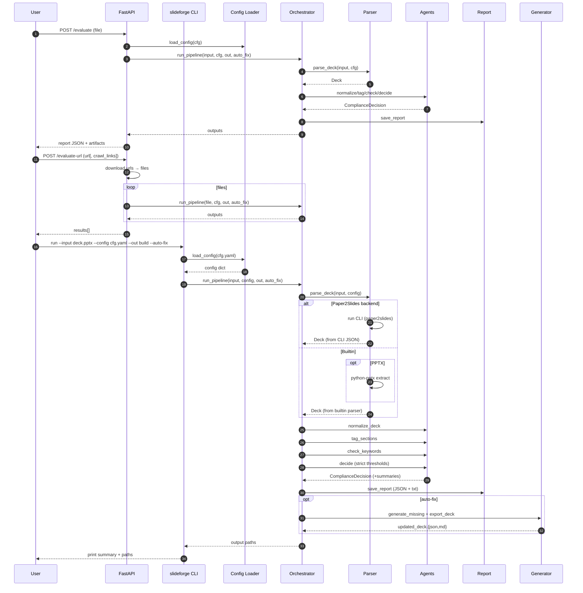

# SlideForge / SlideCheck — How It Works (Step by Step)

Goal: “Extract structure from slides, evaluate them with specialized agents, and optionally generate missing content — in one automated workflow.”

This document explains the repository structure, the execution flow, the core data models and agents, and shows a sequence diagram of the runtime. It also clarifies how PPTX ingestion and the Paper2Slides/Julep integrations work.

## 1) Repository Layout (what lives where)

- `slideforge/` — Python package
  - `cli.py` — CLI entrypoint (`slideforge run|sample`)
  - `models.py` — Data models: `Slide`, `Deck`, evaluation/report models
  - `config.py` — Lightweight YAML/JSON config loader
  - `parsers/`
    - `paper2slides_adapter.py` — Parser adapter
      - Builtin parsers for `.json`, `.md`, `.txt`, and `.pptx`
      - Optional Paper2Slides CLI backend
  - `agents/`
    - `normalizer.py` — Cleans up titles/bullets/notes
    - `section_tagger.py` — Heuristic section tagging + confidence
    - `keyword_checker.py` — Validates required keywords per section
    - `compliance_decider.py` — Computes PASS/NEEDS_UPDATE/FAIL with strict rules
    - `generator.py` — Optional: draft slides for missing/weak coverage
    - `report.py` — Saves JSON + human-readable text report
  - `pipeline/`
    - `orchestrator.py` — Builtin orchestrator (default)
    - `julep_orchestrator.py` — Flagged orchestrator (currently falls back to builtin until wired to Julep)
- `config/`
  - `default.yaml` — Heuristic + strict rules defaults
  - `strict_relaxed.yaml` — Relaxed strictness example
  - `paper2slides_example.yaml` — Paper2Slides CLI backend example
- `schemas/` — JSON Schemas for deck and report
- `docs/` — Usage and flowchart
  - `USAGE.md`, `flowchart.mmd`
- `examples_static/` — Curated example deck (versioned)
- `scripts/` — Utilities (e.g., `smoke_test.py`)
- `Makefile` — Local venv + common tasks
- `README.md` — Quick start

## 2) End-to-end Flow (what happens during `run`)

1. CLI parses args (`slideforge/cli.py`)
   - `slideforge run --input <file> --config <cfg.yaml> --out <dir> [--auto-fix]`
2. Config loads (`slideforge/config.py`)
   - Merges YAML/JSON into a Python dict (`section_rules`, `required_keywords`, `thresholds`, `strict`, `parser`, `orchestrator`).
3. Orchestrator dispatch (`slideforge/pipeline/orchestrator.py`)
   - If `orchestrator: julep` → `julep_orchestrator.py` (currently falls back to builtin)
   - Else builtin path continues
4. Parse input deck (`slideforge/parsers/paper2slides_adapter.py`)
   - If `parser.backend: paper2slides` → run configured CLI → load JSON → `Deck`
   - Else builtin parsers by file extension:
     - `.json` → `Deck.from_dict`
     - `.md`/`.txt` → simple structured parsing
     - `.pptx` → python-pptx to read titles/text frames
5. Normalize (`agents/normalizer.py`)
   - Trim whitespace; ensure bullets/notes are clean
6. Section Tagging (`agents/section_tagger.py`)
   - Heuristic scoring using `section_rules.*.keywords` (title matches weigh more)
   - Writes `slide.section` and `slide.section_confidence`
7. Keyword Checking (`agents/keyword_checker.py`)
   - For each slide with a tagged section, compute coverage against `required_keywords[section]`
8. Compliance Decision (`agents/compliance_decider.py`)
   - Aggregate metrics and apply `thresholds` and `strict` rules
   - Status = PASS | NEEDS_UPDATE | FAIL
   - Produces `reasons` and `recommendations`
   - Computes optional `section_summaries`
9. Report (`agents/report.py`)
   - Write `compliance_report.json` (schema: `schemas/report.schema.json`)
   - Write `compliance_report.txt` (human readable)
10. Optional Generation (`agents/generator.py`)
    - If `--auto-fix`: add placeholder slides for missing sections and low-coverage areas
    - Export updated deck as Markdown + JSON (`updated_deck.md`/`updated_deck.json`)

## 3) Data Models (what objects look like)

- `Slide` (models.py)
  - `index: int`, `title: str`, `bullets: List[str]`, `notes: Optional[str]`
  - `section: Optional[str]`, `section_confidence: Optional[float]`
  - `text_content()` helper for concatenated text
- `Deck`
  - `meta: Dict[str, Any]`, `slides: List[Slide]`
  - `to_dict()`, `from_dict()` for JSON round-trip
- Evaluation/Report
  - `KeywordCheckResult`: `required_keywords`, `found`, `missing`, `coverage`
  - `SlideEvaluation`: per-slide section + keyword coverage
  - `ComplianceDecision`: `status`, `score`, `update_required`, `reasons`, `recommendations`
  - `ComplianceReport`: `meta`, `per_slide`, `overall`, `section_summaries`

## 4) Parsers (how inputs become a Deck)

- Builtin
  - `.json` → expects `schemas/deck.schema.json`
  - `.md`/`.txt` → simple “slide separators” (`---`) and `# Title` + list bullets
  - `.pptx` → uses `python-pptx` to extract:
    - Title: first TITLE placeholder text (if present), else “Untitled”
    - Bullets: all text from non-title shapes’ text frames
- Paper2Slides CLI backend
  - Configure in YAML: `parser.backend: paper2slides`
  - Command template supports placeholders:
    - `{input}` → full path to input file
    - `{tmp}` → a temp directory for intermediate outputs
    - Optional `{output}` if the CLI writes JSON to a file
  - Adapter executes the command and loads JSON either from stdout or the configured output path
  - The JSON must match `schemas/deck.schema.json` (we can map fields if your CLI differs)

## 5) Agents (what each module does)

- Normalizer — remove noise/whitespace
- SectionTagger — heuristic mapping of slides to sections
- KeywordChecker — per-slide coverage against required keywords
- ComplianceDecider — status, reasons, recommendations
  - Strict rules (all configurable):
    - `require_all_sections` — every section in `required_keywords` must appear
    - `min_per_section_coverage` — average coverage required per section
    - `min_slide_coverage` — flag slides below per-slide coverage
    - `min_section_confidence` — low-confidence tags are treated as unassigned
    - `min_slides_per_section` — minimum slides per section
    - `disallow_unassigned` — treat unassigned/low-confidence as violations
    - `fail_on_section_avg_below` — choose FAIL vs NEEDS_UPDATE for section-average shortfalls
- Generator — drafts placeholder slides for missing sections/coverage gaps
- Report — writes JSON + text; includes decision rationale and section summaries

## 6) Orchestrators (builtin vs Julep flag)

- Builtin (`pipeline/orchestrator.py`) — default path executing pure Python agents
- Julep flag (`pipeline/julep_orchestrator.py`)
  - If `orchestrator: julep` is set, dispatch here
  - Currently falls back to builtin while keeping identical outputs
  - Future: replace with real Julep Agents and a Julep pipeline (LLM tools, retries, tracing)

## 7) CLI and Makefile (how you run it)

- CLI entry: `slideforge/cli.py`
  - `slideforge sample --out <dir>` → writes demo inputs and copies default config
  - `slideforge run --input <file> --config <cfg> --out <dir> [--auto-fix]` → full pipeline
- Makefile (project-local venv `hackathon2026`)
  - `make install` → create venv and install package
  - `make env-info` / `make shell` → inspect/use the venv
  - `make sample` / `make run` / `make run-relaxed` / `make run-paper2slides`
  - `make deps-pptx` → install `python-pptx` for PPTX parsing
  - `make run-api` → install API deps and start FastAPI server
  - `make test` → run smoke test

## 8) Outputs (what you get)

- `<out>/compliance_report.json` — machine-readable report
- `<out>/compliance_report.txt` — human-readable summary
- `<out>/updated_deck.json` and `<out>/updated_deck.md` — when `--auto-fix` is enabled

## 9) Sequence Diagram (runtime)

## 10) Error Handling & Common Pitfalls

- PPTX parsing requires `python-pptx`. Install once via `make deps-pptx`.
- Paper2Slides backend requires a working CLI on PATH; verify the command returns valid JSON or writes a JSON file at the configured location.
- If section tagging is off, tune `section_rules.*.keywords` in config.
- If reports say “unassigned slides,” increase `min_section_confidence` or expand `section_rules`.
- To adjust strictness (FAIL vs NEEDS_UPDATE), tweak `strict.*` options (especially `fail_on_section_avg_below`).

## 11) Extending the System

- Replace heuristic tagging with an LLM Agent: swap `section_tagger` for a prompt/tool call; keep interface intact.
- Add exporters (PPTX/PR/Confluence): hook into pipeline after report and implement a new exporter module.
- Integrate real Julep: define Julep agents that mirror the current stateless functions and compose them via Julep’s orchestration.

---

Questions or requests for wiring a specific Paper2Slides CLI JSON format or a Julep agent template? Share details and I’ll adapt the adapter/orchestrator quickly.

## 12) Agents and Julep Orchestration (deep dive)

This section details each agent’s role in the builtin pipeline and how it maps to a Julep-style workflow.

- Normalizer (Tool)
  - Input: `Deck`
  - Output: normalized `Deck`
  - Mapping to Julep: ToolTask calling the same Python function (deterministic, idempotent).

- SectionTagger (Heuristic today; LLM-capable)
  - Input: `Deck`, `config.section_rules`
  - Output: `Deck` with `slide.section` and `slide.section_confidence`
  - Mapping to Julep: Agent prompting an LLM to assign sections and confidence, returning structured JSON mapped onto slides. Heuristic ToolTask remains an alternative path.

- KeywordChecker (Tool)
  - Input: `Deck`, `config.required_keywords`
  - Output: `List[SlideEvaluation]` with coverage/missing
  - Mapping to Julep: ToolTask; optionally extend with LLM evidence extraction per slide in parallel branches.

- ComplianceDecider (Tool)
  - Input: `List[SlideEvaluation]`, `config.thresholds`, `config.strict`
  - Output: `ComplianceDecision` + section summaries and reasons
  - Mapping to Julep: ToolTask; pure logic, easy to retry.

- Report (Tool)
  - Input: `ComplianceReport`
  - Output: JSON + text artifacts
  - Mapping to Julep: ToolTask; can attach Julep trace IDs into report meta.

- Generator (Agent)
  - Input: `Deck`, `ComplianceReport`, thresholds/keywords
  - Output: Updated `Deck` with placeholder/draft content
  - Mapping to Julep: LLM Agent that proposes new bullets/notes for missing keywords/sections, constrained to structured JSON.

Julep state model (proposed)
- A single state object passed through steps, e.g. `{ deck, evaluations, decision, section_summaries, artifacts }`.
- Steps read/write their fields; Julep records tool/agent invocations, errors, retries.

Execution graph
- Linear DAG: Normalize → Tag → Check → Decide → Report → [Generate].
- Optional parallelism: per-slide evidence extraction if added later.

Error handling
- Tool steps: raise explicit exceptions, retried based on policy.
- LLM steps: retry/backoff, guardrails on JSON schema; fallback to heuristic path for Tagger if needed.

Integration plan behind `orchestrator: julep`
- Keep builtin as default.
- When `julep` is selected: construct a Julep workflow with ToolTasks (Normalizer, Checker, Decider, Report) and Agents (Tagger, Generator) and maintain identical I/O contracts.
- Config toggles to blend approaches (e.g., `tagger: heuristic|llm`, `generator: off|llm`).

Example Julep flow (conceptual)
1. ToolTask: `normalize_deck(state.deck)`
2. Agent: `tag_sections_llm(state.deck)` or ToolTask heuristic
3. ToolTask: `check_keywords(state.deck, cfg)` → `state.evaluations`
4. ToolTask: `decide(state.evaluations, cfg)` → `state.decision` (+summaries)
5. ToolTask: `save_report(...)` → `state.artifacts`
6. Agent (optional): `generate_missing_llm(...)` → export updated deck
